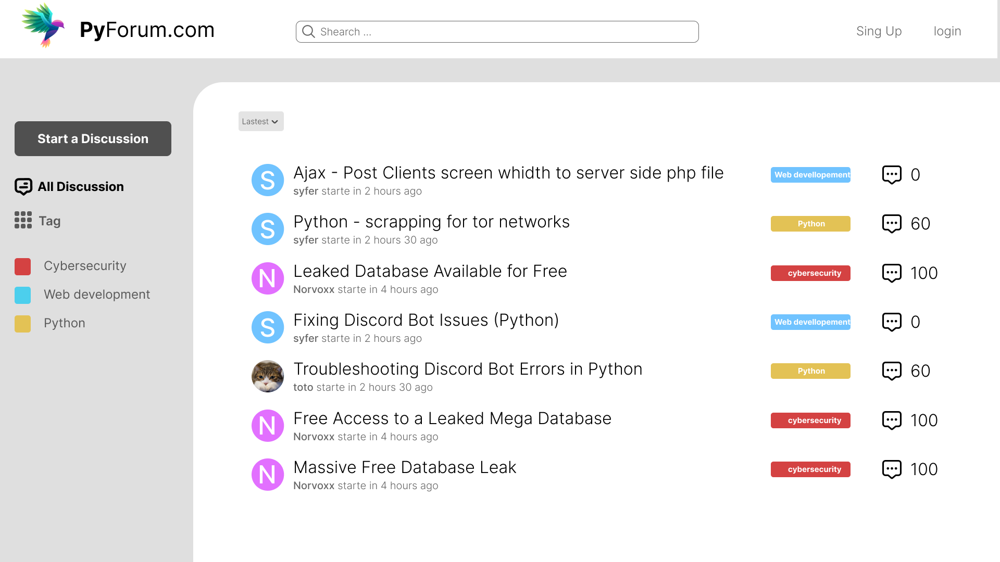

# PyForum
A minimalist yet powerful discussion board built with Flask.

## Demo




## Run Locally

Clone the project

```bash
  git clone git@github.com:foenix208/PyForum.git
```

Go to the project directory

```bash
  cd pyForum
```

Install dependencies

```bash
pip install -r requirements.txt
```

Start the server

```bash
cd src/
flask run
```


## Features

- en cours de développement.

